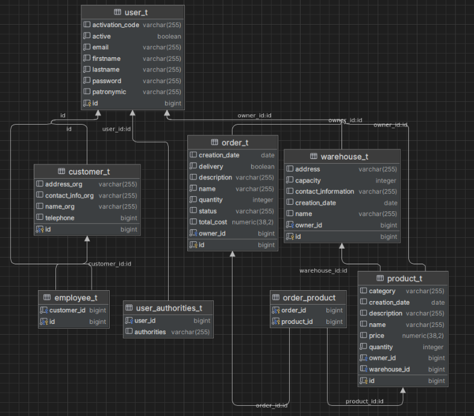

Это приложение предназначено для управления складскими операциями в компании. Пользователи могут просматривать, добавлять, редактировать и удалять информацию о товарах, складах и заказах, а также отслеживать их статусы

exdemo.ru

Функциональность:

1. Пользователи могут зарегистрироваться и войти в систему.
2. Отображение списка всех товаров с возможностью сортировки, поиска.
3. Отображение информации о конкретном товаре.
4. Добавление, редактирование и удаление товаров.
5. Создание нового склада с указанием всех необходимых данных.
6. Отображение списка всех складов с возможностью сортировки, фильтрации и поиска.
7. Отображение информации о конкретном складе, его содержимом и статусе заполненности.
8. Создание нового заказа с выбором товаров и указанием количества.
9. Отображение списка всех заказов с возможностью сортировки, поиска.
10. Отслеживание статуса заказа.

Технологический стек:

- Backend: Java, Spring Framework (Spring Boot, Spring MVC, Spring Data JPA)
- Frontend: HTML, CSS, JavaScript, Thymeleaf (шаблонизатор)
- База данных: PostgreSQL

